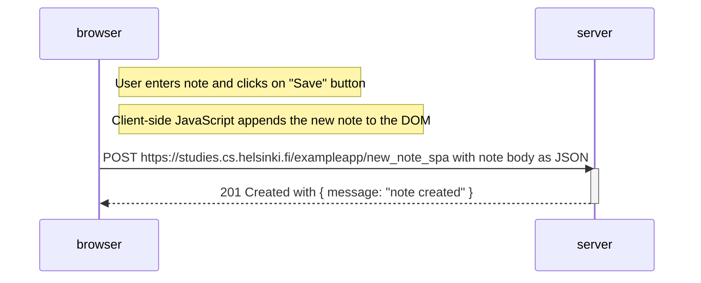

```mermaid
sequenceDiagram
    participant browser
    participant server

    Note right of browser: User enters note and clicks on "Save" button
    Note right of browser: Client-side JavaScript appends the new note to the DOM

    browser->>server: POST https://studies.cs.helsinki.fi/exampleapp/new_note_spa with note body as JSON
    activate server
    server-->>browser: 201 Created with { message: "note created" }
    deactivate server
```